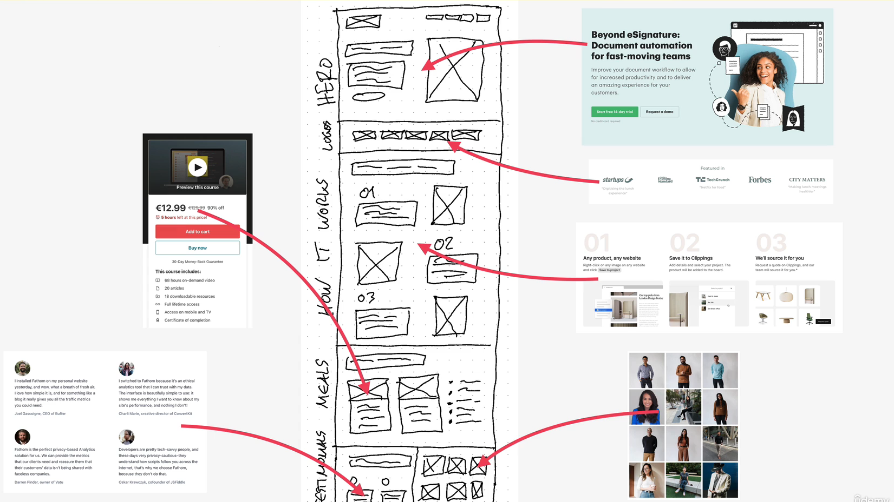

# Course: HTML & CSS

## Project: Omnifood

### Instructor [Jonas Schmedtmann](https://jonas.io/)

This is for learning purposes, with udemy's course [Build Responsive Real-World Websites with HTML and CSS](https://www.udemy.com/course/design-and-develop-a-killer-website-with-html5-and-css3/).

## Sections

Brand color: #e67e22

- [ ] Logo + Navigation
- [ ] Hero
- [ ] Featured in
- [ ] How it works
- [ ] Meals (and list of diets)
- [ ] Testimonials + gallery
- [ ] Pricing + features
- [ ] CTA
- [ ] Footer

